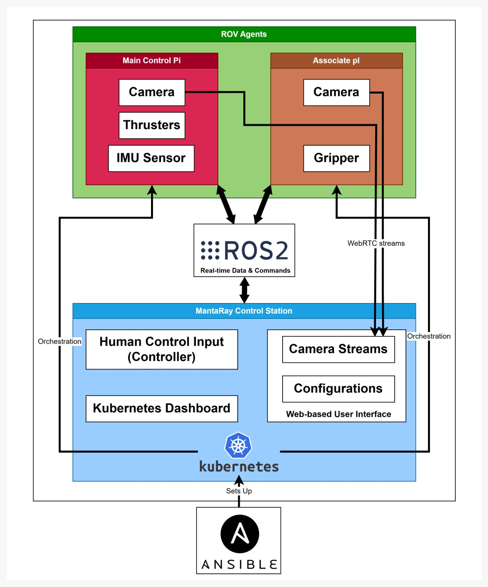

[](https://github.com/zkinhang/Mantaray-on-IaC/actions/workflows/main.yml)
[](https://deepwiki.com/zkinhang/Mantaray-on-IaC)

# Mantaray-on-IaC  

This project was developed for the team **[Manta Ray](https://www.polyu.edu.hk/engineeringentrepreneurshipclub/news-and-events/news/2026/mate-hk-regional-2026/)** in [MATE ROV](https://materovcompetition.org/) 2026.


Infrastructure-as-Code for the **Mantaray ROV** — an underwater remotely operated vehicle. This repository manages the full software stack: ROS2 application source code, Docker containerization, Kubernetes orchestration, and Ansible automation to provision and deploy everything across an extendable 3-node cluster.
  
> Full application documentation (ROS2 node details, hardware specs, system design): [Notion Page](https://mellow-cap-3e1.notion.site/ebd/28700ae3fb2281b3afd4f744baa0d396?v=28700ae3fb2281af9793000cdafe78d9)  
  
--- 

## Architecture

The system runs as a K3s (lightweight Kubernetes) cluster across 3 physical machines. Each machine has a fixed hardware role, and Kubernetes pods are pinned to the correct machine via `nodeSelector`.



---

## Repository Structure
```
.  
├── src/                    # Application source code  
│   ├── ros2/               # ROS2 packages (control, PID, thruster, IMU, etc.)  
│   ├── microRos/           # Micro-ROS firmware source code
│   ├── webUI/              # Web control interface  
│   ├── webrtc_streamer/    # WebRTC video streaming  
│   └── launch_file/        # ROS2 launch file for thrusterboard  
├── docker/                 # Dockerfiles for each image  
│   ├── common/             # Main ROS2 image (amd64 + arm64)  
│   ├── microros/           # Micro-ROS agent image (arm64)  
│   └── webUI/              # Web UI image (amd64)  
├── ansible/                # Automation: playbooks, K8s manifests, config  
│   ├── k8s/                # Kubernetes manifest templates (Jinja2)  
│   ├── vars/               # Deployment, hardware, and infra variables  
│   ├── config/             # Runtime config (robot_params.json)  
│   ├── inventory_infra.ini # Node IPs, users, connection mode (source of truth)  
│   ├── inventory.ini       # App deployment inventory  
│   ├── playbook-infra-airgap.yaml    # Cluster installation  
│   ├── playbook-network-switch.yaml  # ETH ↔ WLAN switching  
│   ├── playbook-app.yaml             # Application deployment  
│   └── playbook-dashboard-setup.yaml # Kubernetes dashboard  
├── .github/workflows/      # CI/CD: build and push images to DockerHub  
├── build_and_copy_to_local_registry.sh  # Sync images to local registry  
└── kube_permission.sh      # Fix kubectl permissions after cluster changes  
```

---

## Prerequisites

#### Hardware

- 3 machines matching the node roles above (x86_64 land PC + 2× ARM64 RPi or similar)
- Passwordless SSH access between the nodes (need setup public-private key pairs)

#### Software (on the machine running Ansible)

- [Python uv](https://docs.astral.sh/uv/)
- docker + docker buildx — for building images
- skopeo — for copying images to the local registry

---

## Documentation

| **Topic** | **Link** |
| --- | --- |
| First-time cluster setup | [**docs/getting-started/full-cluster-setup.md**](docs/getting-started/full-cluster-setup.md) |
| Single-node development mode (1 PC + ESP32) | [**docs/getting-started/single-node-dev.md**](docs/getting-started/single-node-dev.md) |
| Quick tryout without a cluster (Docker only) | [**docs/getting-started/quick-tryout.md**](docs/getting-started/quick-tryout.md) |
| Managing applications (add/remove/modify) | [**docs/operations/managing-applications.md**](docs/operations/managing-applications.md) |
| Switching between ETH and WLAN | [**docs/operations/network-switching.md**](docs/operations/network-switching.md) |
| Updating images and configuration | [**docs/operations/updating-images.md**](docs/operations/updating-images.md) |
| Applications (**`src/`**) | [**docs/components/applications.md**](https://deepwiki.com/search/docs/components/applications.md) |
| Containerization (**`docker/`**) | [**docs/components/containerization.md**](docs/components/containerization.md) |
| Kubernetes manifests (**`ansible/k8s/`**) | [**docs/components/kubernetes.md**](docs/components/kubernetes.md) |
| Ansible automation (**`ansible/`**) | [**docs/components/ansible-automation.md**](docs/components/ansible-automation.md) |
| CI/CD pipeline (**`.github/workflows/`**) | [**docs/components/cd-pipeline.md**](docs/components/cd-pipeline.md) |
| Offline / air-gap mode | [**docs/components/offline-airgap.md**](docs/components/offline-airgap.md) |
| Configuration file reference | [**docs/reference/configuration-files.md**](https://deepwiki.com/search/docs/reference/configuration-files.md) |
| ROS2 node reference | [**docs/reference/ros2-node-reference.md**](docs/reference/ros2-node-reference.md) |

---

## Quick Ansible Command Reference
```bash
# Cluster Installation (first time or full reinstall)
uv run ansible-playbook -i ansible/inventory_infra.ini ansible/playbook-infra-airgap.yaml # Error is expected in this step due to kubeconfig permissions
bash kube_permission.sh
ansible-playbook -i ansible/inventory_infra.ini ansible/playbook-infra-airgap.yaml
uv run ansible-playbook -i ansible/inventory.ini ansible/playbook-app.yaml -e "force_restart=true"
uv run ansible-playbook -i ansible/inventory.ini ansible/playbook-dashboard-setup.yaml

# Network Switch (ETH ↔ WLAN)
uv run ansible-playbook -i ansible/inventory_infra.ini ansible/playbook-network-switch.yaml
bash kube_permission.sh
uv run ansible-playbook -i ansible/inventory.ini ansible/playbook-app.yaml -e "force_restart=true"
uv run ansible-playbook -i ansible/inventory.ini ansible/playbook-dashboard-setup.yaml

# Apply changes from robot_params.json
uv run ansible-playbook -i ansible/inventory.ini ansible/playbook-app.yaml

# Deploy all apps
uv run ansible-playbook -i ansible/inventory.ini ansible/playbook-app.yaml -e "force_restart=true"

# Dashboard setup
uv run ansible-playbook -i ansible/inventory.ini ansible/playbook-dashboard-setup.yaml

# Verify cluster
kubectl get nodes
kubectl get pods -A
```

#### Troubleshooting: Lost internet after network switch

Restart the system service by:

```bash
sudo systemctl restart NetworkManager
```

---

## Playbook Reference

| Playbook | Purpose | When to run |
|----------|---------|---------|
| `playbook-infra-airgap.yaml` | Full cluster installation |Initial setup, hardware replacement, full reinstall |
| `playbook-network-switch.yaml` | Reconfigure cluster networking | IP change, ETH ↔ WLAN switch |
| `playbook-app.yaml` | Deploy applications, apply config | Code updates, `robot_params.json` changes |
| `playbook-dashboard-setup.yaml` | Deploy Kubernetes dashboard | When found dashboard is not accessible |

---

## Important Notes

#### Kubernetes Permission Issue

Currently, kubectl permissions are not automatically configured. **You must run the following after any cluster configuration:**

```bash
bash kube_permission.sh
```

This script copies the kubeconfig and sets correct ownership:
```bash
sudo cp /etc/rancher/k3s/k3s.yaml ~/.kube/config
sudo chown "$USER":"$USER" ~/.kube/config
```
---

## TODO

- [ ] Fix automatic Kubernetes permission configuration
- [ ] Automation pipeline or cron job for copying images to local registry
- [x] Integrate webRTC to cluster
- [x] Integrate webUI to cluster
