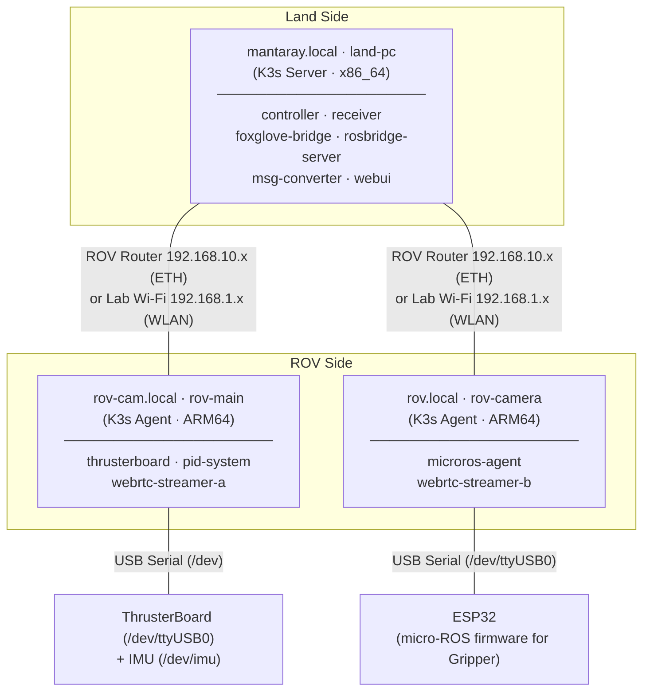
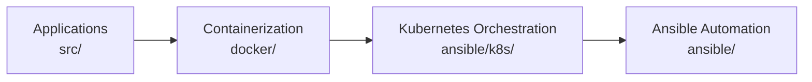

# Architecture  
  
This document describes the full system architecture of Mantaray-on-IaC, and how the physical hardware, infrastructure, containerization, and application layers link together.  
  
> For ROS2 node-level details (topics, services, message types), see the [Notion documentation](https://mellow-cap-3e1.notion.site/ebd/28700ae3fb2281b3afd4f744baa0d396?v=28700ae3fb2281af9793000cdafe78d9).  
  
---  
  
## System Overview  
  
Mantaray is an underwater ROV controlled over a local network. The software stack runs as a **K3s (lightweight Kubernetes) cluster** across 3 physical machines. Each machine has a fixed hardware role; Kubernetes pods are pinned to the correct machine using `nodeSelector`. All ROS2 nodes communicate over the host network using DDS discovery.  
  


---

## Layer

The system is organized into four layers, each managed by a different part of this repository.



---

## Layer 1 — Applications (`src/`)

Source code for all software running on the ROV system.

| Directory | Language | Purpose |
| --- | --- | --- |
| `src/ros2/` | Python / C++ | Core ROS2 packages (see below) |
| `src/microRos/` | C++ | Micro-ROS firmware for ESP32 |
| `src/webUI/` | React + Vite | Browser-based control interface |
| `src/webrtc_streamer/` | Python | WebRTC video streaming node |
| `src/launch_file/` | Python | ROS2 launch file for thrusterboard |

### Important ROS2 Packages (`src/ros2/`)

| Package | Key Node | Role |
| --- | --- | --- |
| `controller_pkg` | `joystick_reader` | Reads joystick input, publishes control commands |
| `receiver_pkg` | `decomposer` | Translates high-level commands to hardware signals (grippers, etc.) |
| `control_system_pkg` | `pid_system_node` | PID stabilization (pitch, yaw, roll, depth) |
| `control_system_pkg` | `msg_converter` | Converts message formats between nodes |
| `thrusterboard_pkg` | (via launch file) | Direct communication with thruster hardware |
| `fdilink_ahrs_ROS2` | (via launch file) | AHRS/IMU sensor driver |
| `custom_interfaces` | — | Customized ROS2 msg/srv definitions, being used when build packages |

---

## Layer 2 — Containerization (`docker/`)

Three Docker images package the application code for deployment. All images are built by CI and pushed to DockerHub; in offline mode they are copied from DockerHub to the local registry.

| Image | Dockerfile | Architectures | Contents |
| --- | --- | --- | --- |
| `manta-ray-ros` | `docker/common/` | amd64 + arm64 | All ROS2 packages, webrtc streamer |
| `microros-with-esptool` | `docker/microros/` | arm64 only | Micro-ROS agent, esptool |
| `mantaray-control-interface` | `docker/webUI/` | amd64 only | Web UI static server |

The main image is multi-arch because it runs on both the x86_64 land PC and the ARM64 ROV nodes.

---

## Layer 3 — Kubernetes Orchestration (`ansible/k8s/`)

Kubernetes manifests are written as **Jinja2 templates** ([manta-ray-deployment.yaml.j2](../ansible/k8s/manta-ray-deployment.yaml.j2)) and rendered by Ansible at deploy time. Variables (image names, hardware paths) are injected from `ansible/vars/`.

### Pod to Node Mapping

Every pod uses `nodeSelector` to pin to a specific physical machine by its `ros2-hardware` label.

| Deployment | Node Label | Image | Hardware Access (Volume Mount) |
| --- | --- | --- | --- |
| `controller-deployment` | `land-pc` | `manta-ray-ros` | `/dev/input` (joystick) |
| `receiver-deployment` | `land-pc` | `manta-ray-ros` | ConfigMap params |
| `foxglove-bridge-deployment` | `land-pc` | `manta-ray-ros` | — |
| `rosbridge-server-deployment` | `land-pc` | `manta-ray-ros` | — |
| `msg-converter-deployment` | `land-pc` | `manta-ray-ros` | — |
| `webui-deployment` | `land-pc` | `mantaray-control-interface` | — |
| `thrusterboard-deployment` | `rov-main` | `manta-ray-ros` | `/dev` (serial), ConfigMap params |
| `pid-system-deployment` | `rov-main` | `manta-ray-ros` | `/dev/imu`, ConfigMap params |
| `webrtc-streamer-a-deployment` | `rov-main` | `manta-ray-ros` | `/dev/video1` (camera A) |
| `webrtc-streamer-b-deployment` | `rov-camera` | `manta-ray-ros` | `/dev/video1` (camera B) |
| `microros-agent-deployment` | `rov-camera` | `microros-with-esptool` | `/dev/ttyUSB0` (ESP32) |

### Key Design Patterns for Kubernetes Manifests

**`hostNetwork: true` + `hostIPC: true`**
All ROS2 pods use host networking. This is required for ROS2 DDS discovery to work across containers on the same machine without complex network overlays.

**`privileged: true`**
Pods that access physical hardware (joystick, serial ports, cameras, IMU) run in privileged mode to bypass Linux device permission restrictions.

> Note: There should be a better practice for the container ownership configuration, e.g. proper UID/GID mapping in the volume mount

**Node labels**
Labels (`ros2-hardware: land-pc`, `rov-main`, `rov-camera`) are applied to K3s nodes during cluster setup by [playbook-infra-airgap.yaml](../ansible/playbook-infra-airgap.yaml) or [playbook-network-switch.yaml](../ansible/playbook-network-switch.yaml), matching each node's IP address to its role defined in [ansible/vars/infra-vars.yaml](../ansible/vars/infra-vars.yaml).

---

## Layer 4 — Ansible Automation (`ansible/`)

Ansible manages both cluster infrastructure and application deployment.

### Playbooks

| Playbook | Purpose |
| --- | --- |
| `playbook-infra-airgap.yaml` | Full K3s cluster installation, local registry setup, node labeling |
| `playbook-network-switch.yaml` | Reconfigure cluster networking (ETH ↔ WLAN, IP changes), can be used to fix any potential network issues in most time |
| `playbook-app.yaml` | Render and apply K8s manifests, inject configuration |
| `playbook-dashboard-setup.yaml` | Deploy Kubernetes dashboard, generate admin token |

### Configuration & Variable Files

| File | Controls |
| --- | --- |
| `ansible/inventory_infra.ini` | Node IPs, SSH users, `connection_mode` (eth/wlan) — **source of truth for infrastructure** |
| `ansible/vars/infra-vars.yaml` | K3s paths, local registry port, node labels, physical network interface names |
| `ansible/vars/deployment-vars.yaml` | Active image tags, list of enabled deployments |
| `ansible/vars/hardware-paths.yaml` | Linux device paths (cameras, IMU, serial ports) mounted into pods |
| `ansible/config/robot_params.json` | Runtime parameters: PID gains, thruster mapping, gripper config, sensor settings |

### Parameter Injection Flow

Runtime parameters flow from a single JSON file into running pods:

```
ansible/config/robot_params.json
  └─► Ansible playbook-app.yaml
        └─► Kubernetes ConfigMap "robot-parameters"
              └─► Volume mounted at /config inside pod
                    └─► ROS2 node launched with --params-file /config/params.yaml
```

Typical pods that use this flow: `receiver-deployment`, `thrusterboard-deployment`, `pid-system-deployment`.

Other variables (image names, hardware paths, enabled deployments) are injected directly into the Kubernetes manifest template at render time.

---

## CI/CD Pipeline (`.github/workflows/`)

GitHub Actions builds and pushes Docker images on every push to `master`.

### Path-Based Change Detection

Only images whose source files changed are rebuilt:

| Image | Triggered by changes in |
| --- | --- |
| `manta-ray-ros` (amd64 + arm64) | `docker/common/`, `src/ros2/`, `src/launch_file/`, `src/webrtc_streamer/` |
| `microros-with-esptool` (arm64) | `docker/microros/`, `src/microRos/` |
| `mantaray-control-interface` (amd64) | `docker/webUI/`, `src/webUI/` |

### Image Versioning

- CI always pushes as `:latest` to DockerHub.

> Note: in the future, it is suggested to make an auto-increment for version numbers and declare which version of image to use in [ansible/vars/deployment-vars.yaml](../ansible/vars/deployment-vars.yaml)

- The actual image tag used in deployment is set in `ansible/vars/deployment-vars.yaml` (e.g., `manta-ray-ros:0.98.3`). Update this file to pin a specific version.

### Gap: Local Registry Sync

CI only pushes to DockerHub. Copying images to the local registry (`mantaray.local:5000`) for offline/air-gap deployment is a **manual step** — see [updating images](operations/updating-images.md).

---

## Network Modes

The cluster supports two network configurations, switched via `connection_mode` in `ansible/inventory_infra.ini`:

| Mode | Interface | IP Range | Use Case |
| --- | --- | --- | --- |
| `eth` | Ethernet | `192.168.10.x` | ROV router, air-gapped operation |
| `wlan` | Wi-Fi | `192.168.1.x` | Lab Wi-Fi, internet access available |

Physical interface names per node are defined in [ansible/vars/infra-vars.yaml](../ansible/vars/infra-vars.yaml) (e.g., `enp3s0` for land-pc ethernet, `eth0` for ROV nodes).

---

## Offline / Air-Gap Mode

When operating over the ROV router (`eth` mode), the ROV nodes have no internet access. All container images must be pre-loaded into the local Docker registry running on `mantaray.local:5000`.

```
DockerHub (zkinhang/*, depends on the credential stored in github secret vault for CD pipeline)
  └─► skopeo copy (build_and_copy_to_local_registry.sh)
        └─► mantaray.local:5000/*
              └─► K3s pulls images from local registry
```

See [Offline / Air-Gap Mode](components/offline-airgap.md) for setup instructions.