# Full cluster setup

This guide installs the standard three-node, air-gapped K3s deployment: one land-PC server and two ROV agents. Complete the [prerequisites](prerequisites.md) first. If you are setting up a new Ubuntu machine, begin with [Ubuntu workstation setup](ubuntu-workstation-setup.md).

> Warning: a forced installation removes the existing K3s installation from every enabled node. Be careful on it.

## 1. Prepare the control workstation

Clone the repository and install the pinned Ansible environment:

```bash
git clone https://github.com/zkinhang/Mantaray-on-IaC.git
cd Mantaray-on-IaC
git lfs install
git lfs pull
uv sync
```

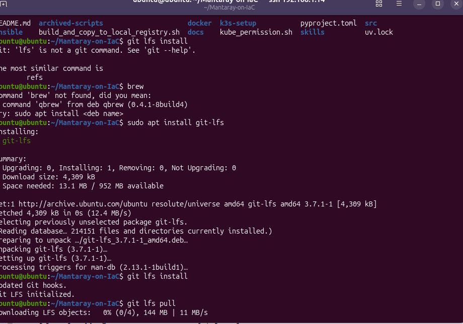

The large K3s air-gap files are stored through Git LFS. `git lfs pull` is required before a forced installation.

## 2. Configure the infrastructure inventory

Edit `ansible/inventory_infra.ini` before running any playbook.

- Set `ansible_user` to valid SSH users.
- Set each enabled node's hostname, `ansible_host`, and `ansible_k3s_server_ip` or `ansible_k3s_agent_ip`.
- For agent nodes, if you want to disable it for testing, can comment out the agent lines.
- Set `connection_mode` to `eth` or `wlan`, depending on the internet is connected via ethernet (eth) or Wi-Fi (wlan)
- Set `force_k3s_reinstall=true` for a brand-new installation or deliberate rebuild.

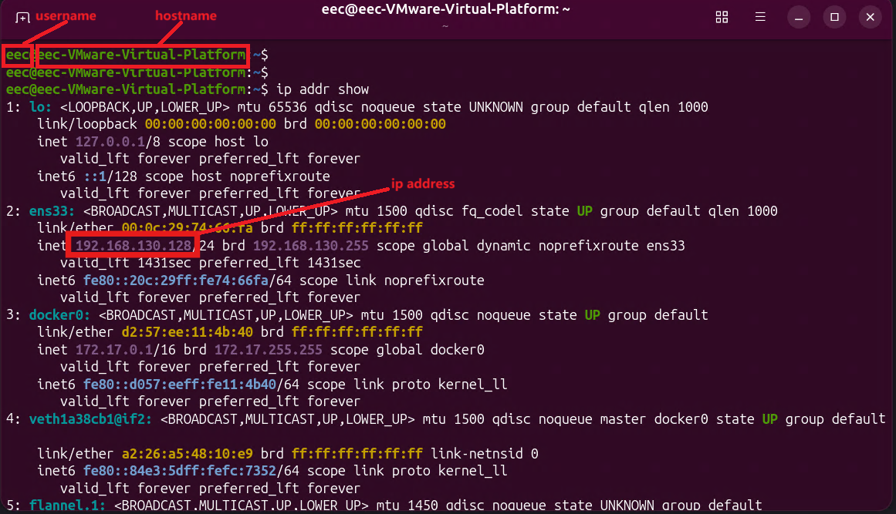

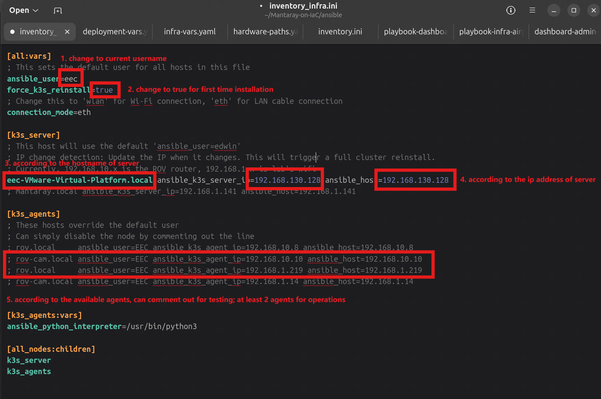

Then edit `ansible/vars/infra-vars.yaml`:

- Set `k3s_setup_dir` to the absolute path of this repository's `k3s-setup` directory on the control workstation.
- Confirm the entries in `default_node_labels` match the enabled inventory hostnames.
- Confirm `node_interface_map` maps each hostname and connection mode to the correct Linux network-interface name.

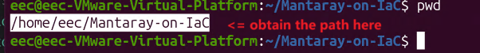

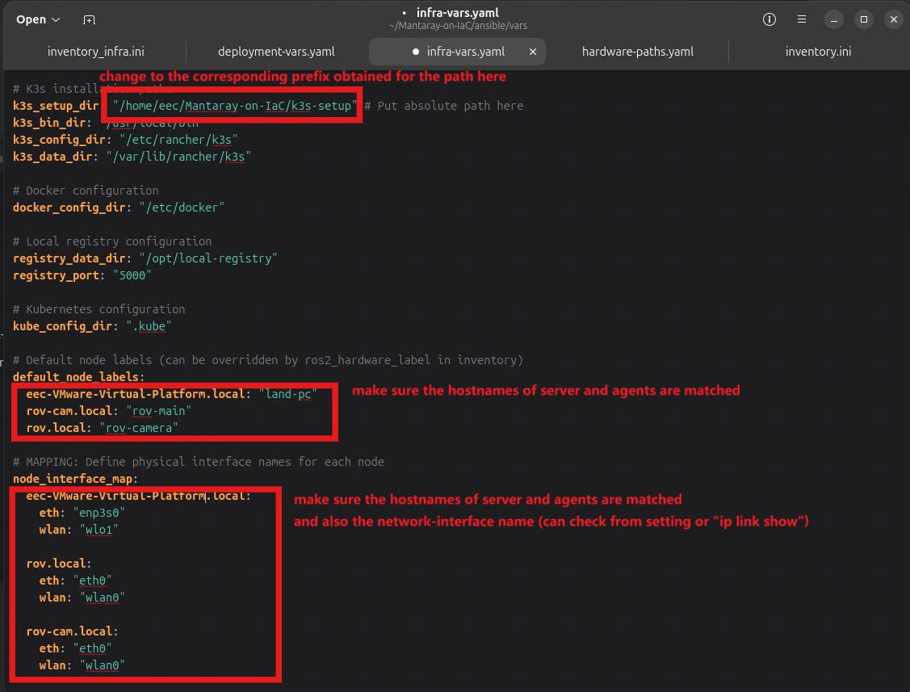

For a Wi-Fi or IP-address change, update both files together. See [Network switching](../operations/network-switching.md) for the operational workflow.

## 3. Select the application image source

Edit `ansible/vars/deployment-vars.yaml` to tell Kubernetes where to pull the application images. The `main_ros_image`, `microros_image`, and `web_ui_image` variables are used by the application deployment manifest.

- `mantaray.local:5000/...` refers to the project's local registry. Use it only after copying the required images into that registry.
- `zkinhang/...` refers to the published Docker Hub images. This is the current workflow, so use these values when the nodes can reach the internet and Docker Hub:

  ```yaml
  main_ros_image: "zkinhang/manta-ray-ros:latest"
  microros_image: "zkinhang/microros-with-esptool:latest"
  web_ui_image: "zkinhang/mantaray-control-interface:latest"
  ```

Leave the Kubernetes Dashboard image entries unchanged unless you are also changing the dashboard's registry strategy.

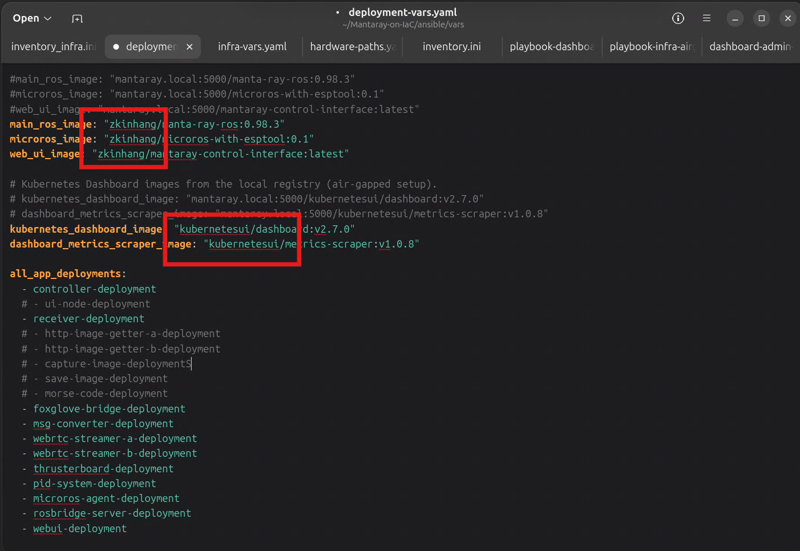

## 4. Verify SSH and privilege escalation

Each enabled host must be reachable before installation:

```bash
ping <node-ip>
ssh <username>@<node-ip>
```

Set up SSH keys from the control workstation for the account named in the inventory:

```bash
ssh-keygen
ssh-copy-id <username>@<node-ip>
```

## 5. Install or reconfigure K3s

Run the infrastructure playbook from the repository root:

```bash
uv run ansible-playbook -i ansible/inventory_infra.ini ansible/playbook-infra-airgap.yaml
```

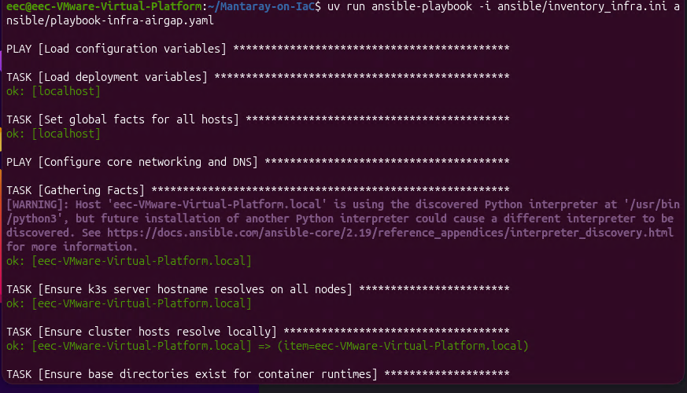

The playbook configures node networking and DNS on every run. When `force_k3s_reinstall=true`, it also installs K3s from the bundled air-gap assets, configures the local Docker registry, and applies node labels.

If the first run reports that `kubectl` cannot read its configuration, run the permission helper and repeat the playbook:

```bash
bash kube_permission.sh
uv run ansible-playbook -i ansible/inventory_infra.ini ansible/playbook-infra-airgap.yaml
```

## 6. Deploy the applications

Confirm that the image source selected in the previous step is reachable from every node before deployment.

Deploy the application manifests:

```bash
uv run ansible-playbook -i ansible/inventory.ini ansible/playbook-app.yaml -e "force_restart=true"
```

Note: The command without `-e "force_restart=true"` is intentionally deisgned for updating the mapping/pid values in a quick way instead of restarting all the applications.

## 7. Set up the Kubernetes Dashboard

```bash
uv run ansible-playbook -i ansible/inventory.ini ansible/playbook-dashboard-setup.yaml
```

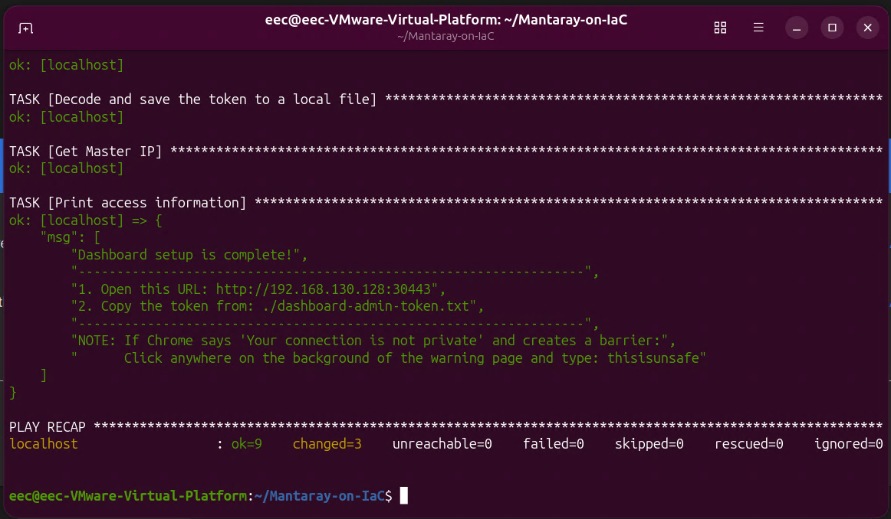

The playbook prints the dashboard URL and writes the login token to `dashboard-admin-token.txt` in the directory where you run the command. The browser may warn about the dashboard's self-signed certificate; can simply proceed to access the page.

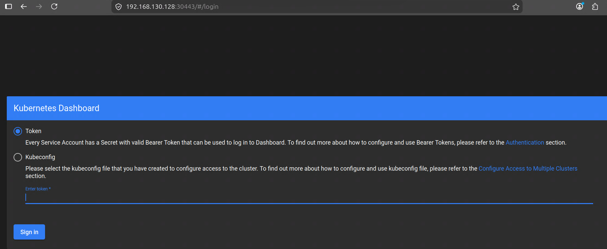

And you may save the token in browser. Note that everytime running this dashboard setup playbook will refresh the toekn as well.

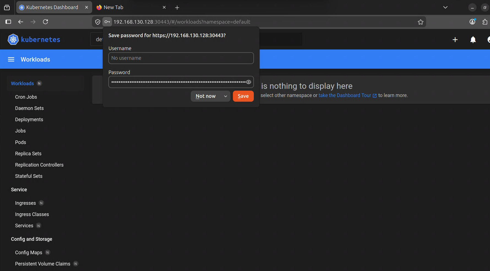

## 8. Verify the deployment

```bash
kubectl get nodes
kubectl get pods -A
```

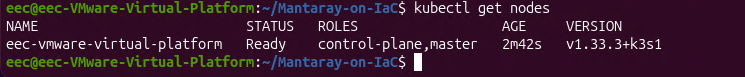

All enabled inventory nodes should appear as `Ready`. For the three-node deployment, check that the server and both agents have the expected IP addresses and hostnames.

Note: The variables configured in `ansible/inventory_infra.ini` and `ansible/vars/infra-vars.yaml` must agree, including connection_mode, ip addresses, hostnames, network-interface names.

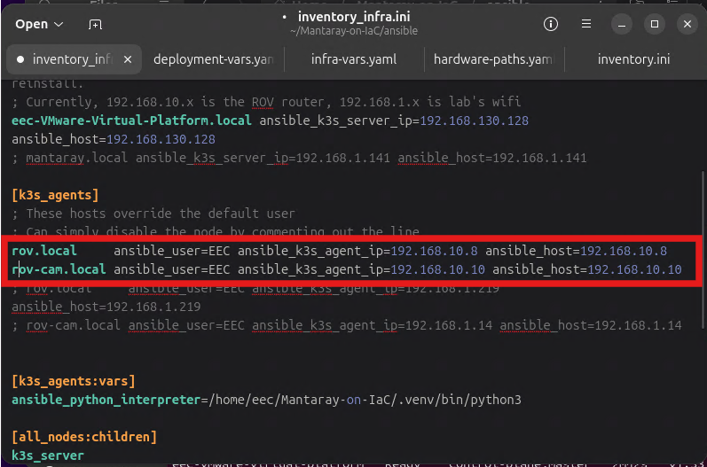