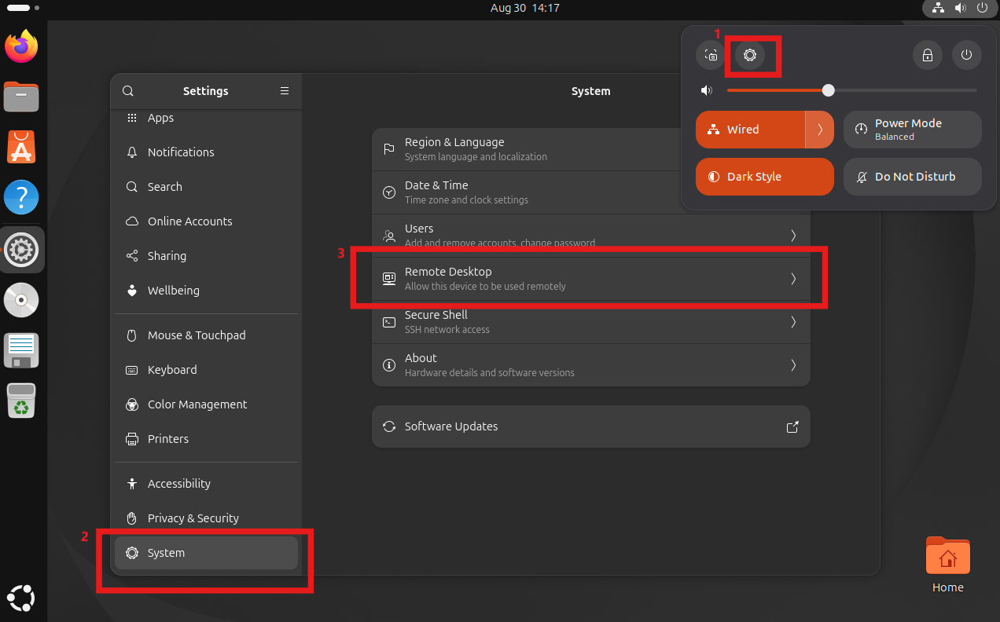
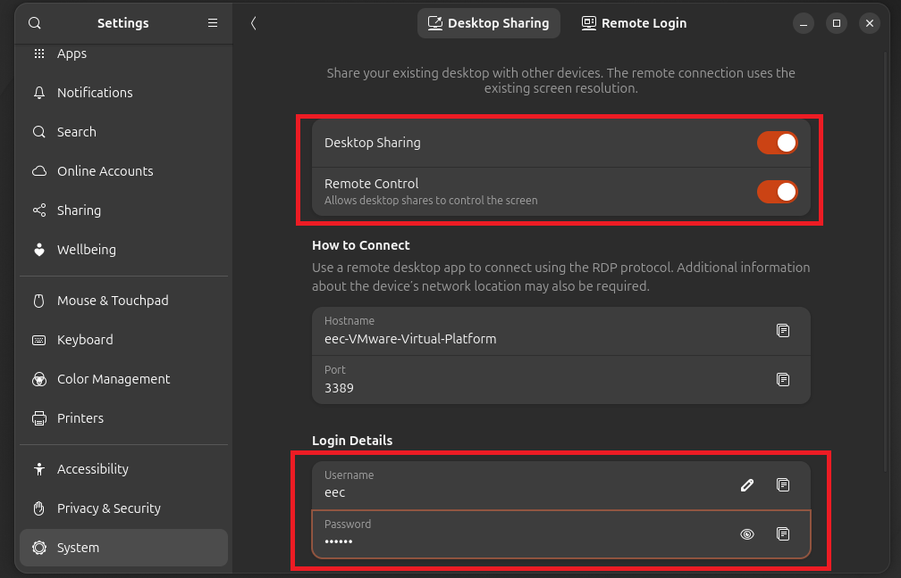
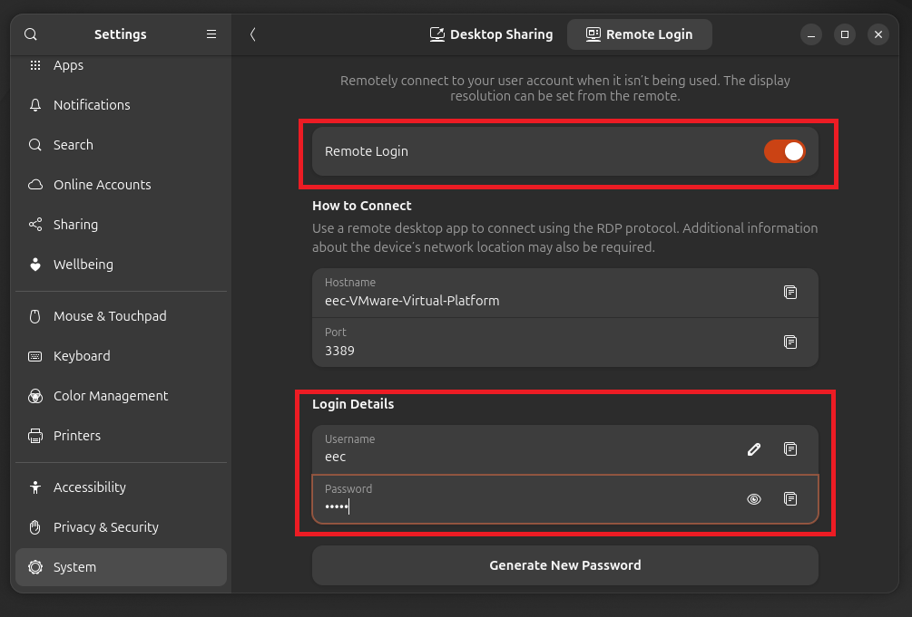
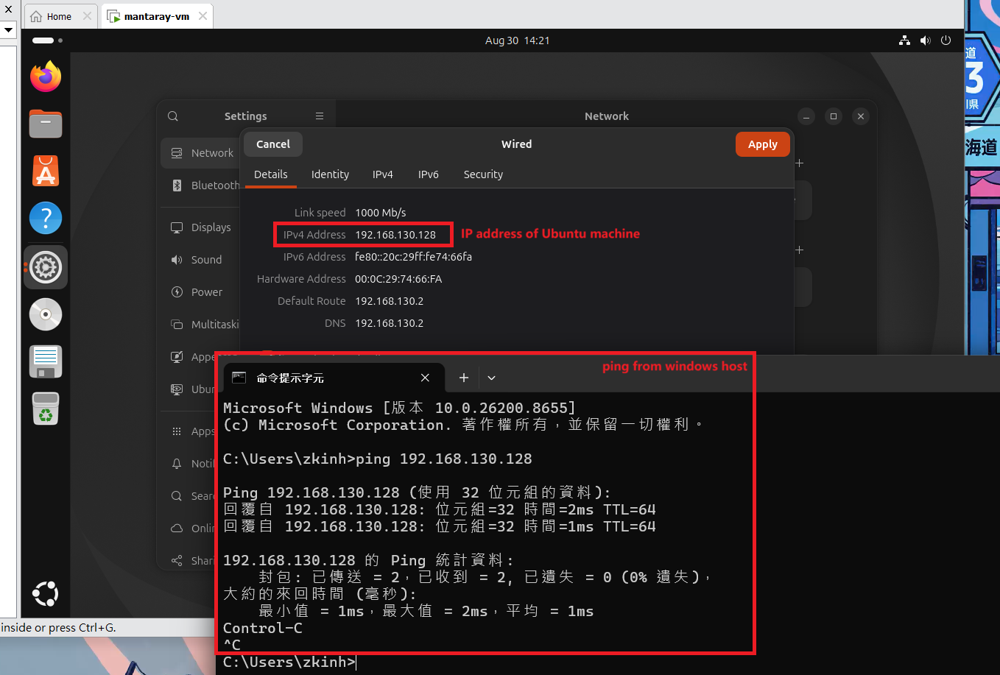
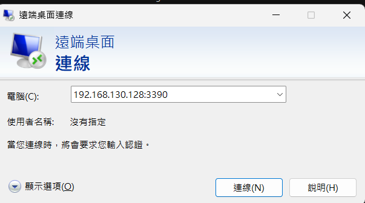
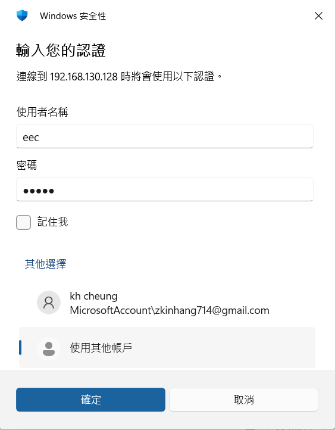
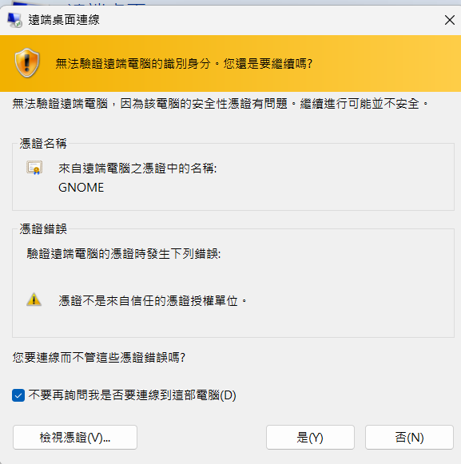
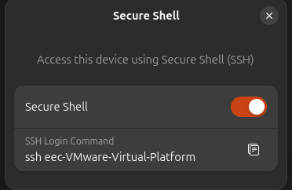

# Connect to Ubuntu from Windows with Remote Desktop

Use GNOME Remote Desktop to manage an Ubuntu control workstation from Windows. This is optional: it does not affect Ansible, K3s, or the ROV deployment.

## Enable Remote Desktop in Ubuntu

1. Open **Settings** and select **System → Remote Desktop**.

   

2. Enable **Desktop Sharing** and **Remote Control**. Set the Remote Desktop username and password.

   

3. Enable **Remote Login** if you need to connect while no local desktop session is active, then set its credentials as well.

   

5. Note the Ubuntu machine's IP address and confirm the Windows computer can reach it:

   ```bash
   ping <ubuntu-ip>
   ```

   

The Ubuntu computer must be powered on and on the same reachable network as the Windows computer.

## Connect from Windows

1. Open **Remote Desktop Connection** (`mstsc`).
2. Enter the Ubuntu host as `<ubuntu-ip>:3390`.

   


3. Select **Connect** and enter the Remote Desktop credentials configured in Ubuntu.

   

4. Accept the GNOME Remote Desktop certificate prompt only after confirming the host IP is correct.

   

## Note: ensure SSH is enabled

Remote Desktop is useful for graphical work; SSH remains the normal transport for Ansible. Enable the SSH server if it is not already installed:

```bash
sudo apt update
sudo apt install -y openssh-server
sudo systemctl enable --now ssh
```



From the control workstation, configure SSH keys for the cluster nodes as described in [Ubuntu workstation setup](ubuntu-workstation-setup.md).
