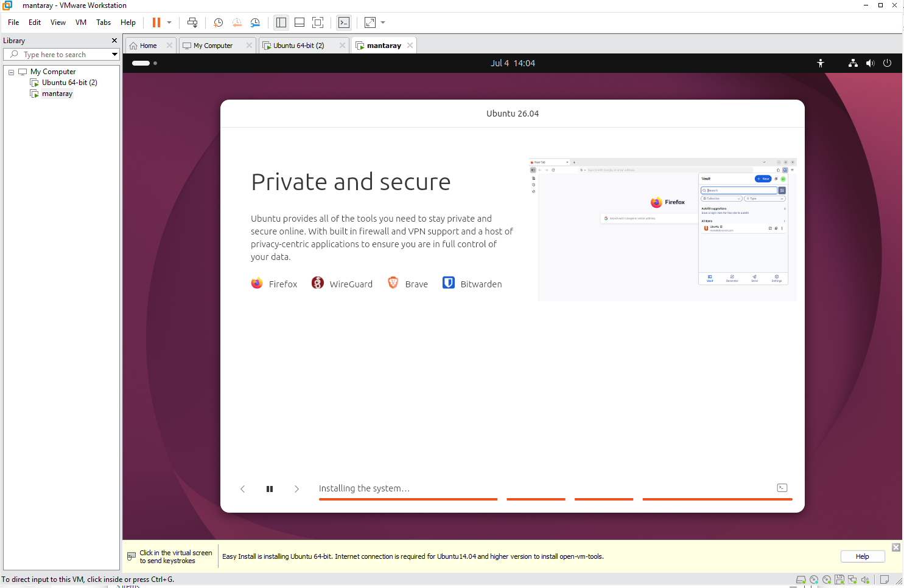
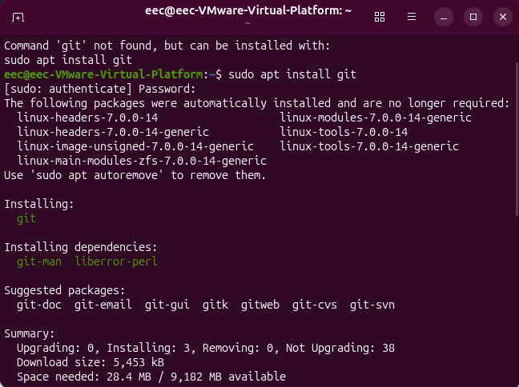
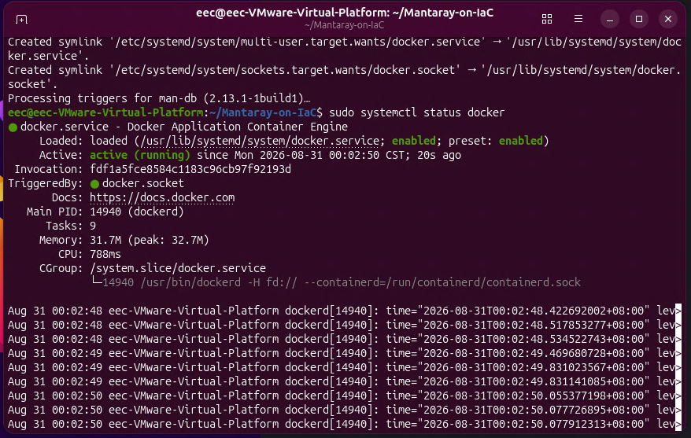
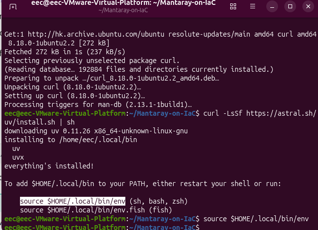
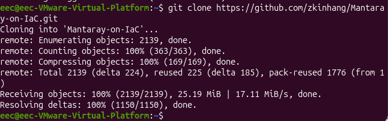
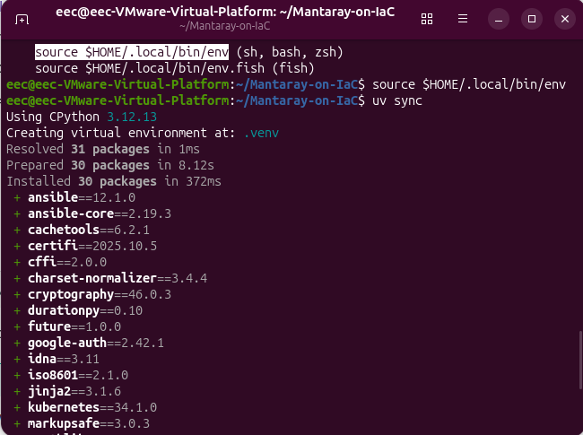
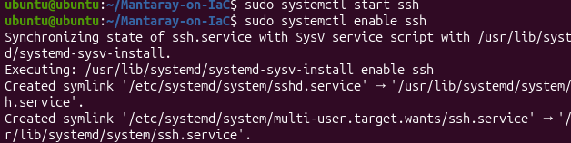
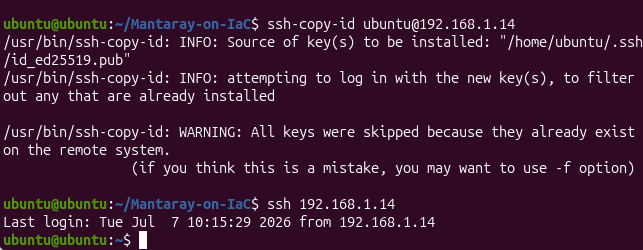
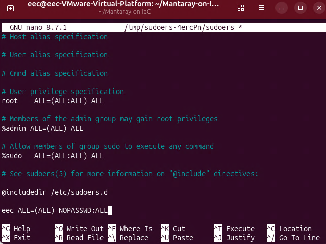

# Ubuntu workstation setup

Prepare an Ubuntu workstation to act as the Ansible control host and Kubernetes server for Mantaray-on-IaC. This is intended to be assigned on land PC or an VM for testing. The workstation must be able to reach the cluster nodes and should have enough disk space for the Git LFS and container assets.



If you manage Ubuntu from Windows, optionally configure [Remote Desktop](ubuntu-remote-desktop.md) first.

## Install base tools

```bash
sudo apt update
sudo apt install -y git git-lfs curl openssh-client openssh-server
```



Install Docker Engine using the [official Ubuntu installation instructions](https://docs.docker.com/engine/install/ubuntu/). Confirm that the service is running:

```bash
sudo systemctl status docker
```



Install [uv](https://docs.astral.sh/uv/), then load it into the current shell:

```bash
curl -LsSf https://astral.sh/uv/install.sh | sh
source "$HOME/.local/bin/env"
```



## Clone the project and install its environment

```bash
git clone https://github.com/zkinhang/Mantaray-on-IaC.git
cd Mantaray-on-IaC
git lfs install
git lfs pull
uv sync
```





`git lfs pull` downloads the air-gap K3s assets required by a forced K3s installation.

## Configure SSH access

Make sure the SSH service is enabled on any machine Ansible must contact:

```bash
sudo systemctl enable ssh
```



Create an SSH key on the control workstation and copy it to each enabled node:

```bash
ssh-keygen
ssh-copy-id <username>@<node-ip>
```



The playbooks uses privilege escalation. Configure passwordless sudo for the Ansible account here.

```bash
sudo visudo
# add the following line at last, the user account is eec in this example
eec ALL=(ALL) NOPASSWD:ALL
```



## Continue with the cluster configuration

Edit `ansible/inventory_infra.ini` and `ansible/vars/infra-vars.yaml` to reflect the machine names, IP addresses, chosen network interface, and absolute repository path. Then follow [Full cluster setup](full-cluster-setup.md).
